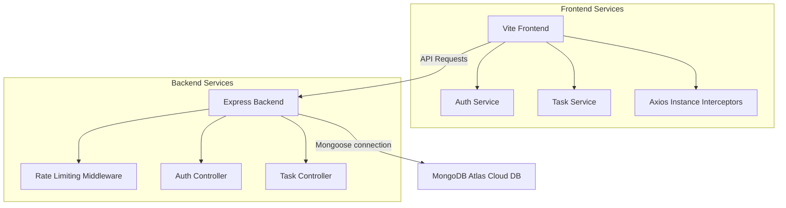

# TaskFlow — MERN Stack Task Management System

TaskFlow is a premium, full-stack task management application built with **React, TypeScript, Tailwind CSS, Express, Node.js, and MongoDB Atlas**. It is packed with rich UX features such as persistent dark/light theme options, skeleton loaders, warning overlays, live password validation, session-expired warnings, and dual-layer API rate protection.

---

## Architecture Diagram



---

## Core Features

- **Robust Authentication**: Sign up and login with dynamic password strength check rules, passwords-match checks, and input eye toggles.
- **Session Expiry Warnings**: 401 Unauthorized errors automatically trigger local state cleanup, redirecting the user to login with a warning alert toast.
- **Responsive Dashboard**: Stats summary cards, live search, filtering by task status, and CRUD task features.
- **Protected Routing**: React Router guards ensuring only logged-in users access the dashboard.
- **Delete Confirmation Warning**: Deleting a task launches a glassmorphic warning overlay requiring explicit approval.
- **Pulsing Skeleton Loader**: Task entry skeleton cards pulse during retrieval, replacing harsh spinners and layout shifts.
- **Persistent Dark/Light Mode**: Persists preferred themes in `localStorage` and aligns automatically to OS preferences.
- **API Abuse Protection**: Dual-tier custom memory rate limiter protecting authentication (30req/15m) and task endpoints (300req/15m).

---

## Prerequisites

Make sure you have the following installed:
- [Node.js](https://nodejs.org/) (v18 or higher)
- [Bun](https://bun.sh/) (Recommended) or [NPM](https://www.npmjs.com/)
- A [MongoDB Atlas](https://www.mongodb.com/cloud/atlas) account

---

## Setup & Installation

### 1. Clone the repository and navigate to the project root:
```bash
cd Mern_Stack_Project
```

### 2. Configure Backend
1. Navigate to the backend directory:
   ```bash
   cd backend
   ```
2. Install dependencies:
   ```bash
   bun install
   # or npm install
   ```
3. Create a `.env` file in the `backend` folder:
   ```env
   PORT=5000
   MONGO_URI=your_mongodb_connection_string
   JWT_SECRET=your_jwt_secret_key
   ```
   *Note: Ensure your MongoDB Atlas cluster has network access enabled for your current IP or configured to `0.0.0.0/0` (all IPs).*

### 3. Configure Frontend
1. Navigate to the frontend directory:
   ```bash
   cd ../frontend
   ```
2. Install dependencies:
   ```bash
   bun install
   # or npm install
   ```

---

## Running the Application

For a fully working stack, you need to run both the backend API server and the frontend client simultaneously.

### Running the Backend
From the `backend` directory, run:
```bash
bun run dev
# or npm run dev
```
The server will start at [http://localhost:5000](http://localhost:5000).

### Running the Frontend
From the `frontend` directory, run:
```bash
bun run dev
# or npm run dev
```
The application will launch at [http://localhost:5173](http://localhost:5173).

---

## Command Reference

| Directory | Command | Description |
|-----------|---------|-------------|
| `backend` | `bun run dev` | Runs Express server with nodemon reloading. |
| `backend` | `bun run start` | Runs Express server in production. |
| `frontend` | `bun run dev` | Runs Vite development server. |
| `frontend` | `bun run build` | Compiles TypeScript declarations and builds production assets. |
| `frontend` | `bun run preview` | Previews the compiled production build locally. |
